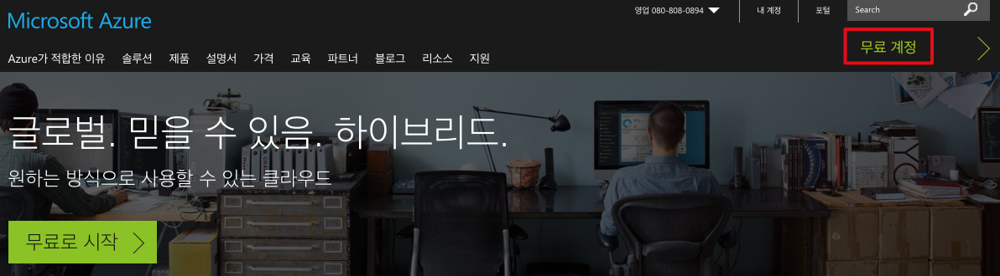
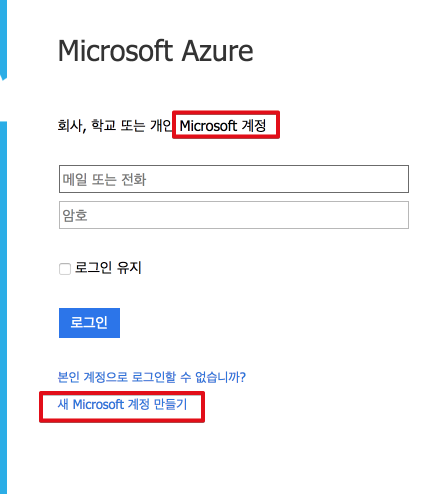
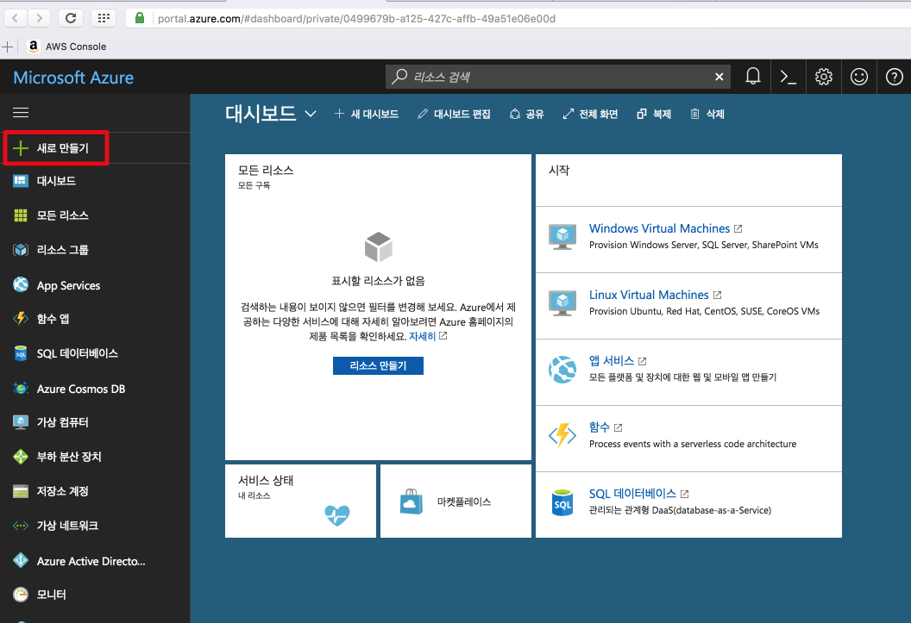
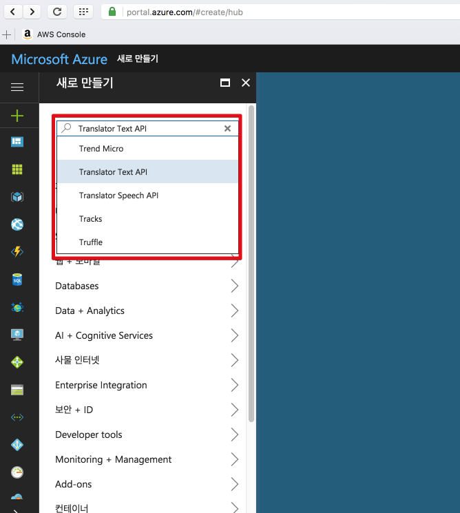
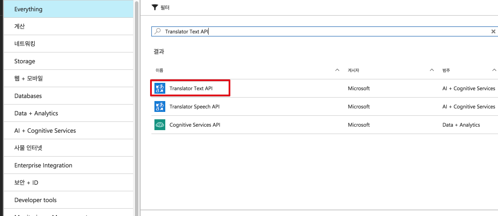
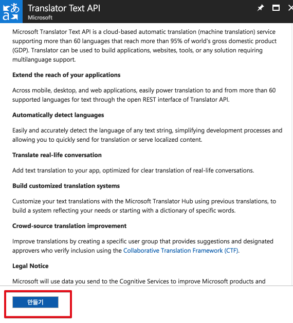
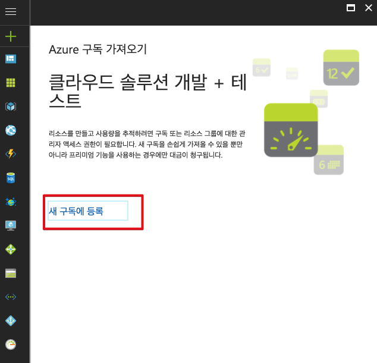
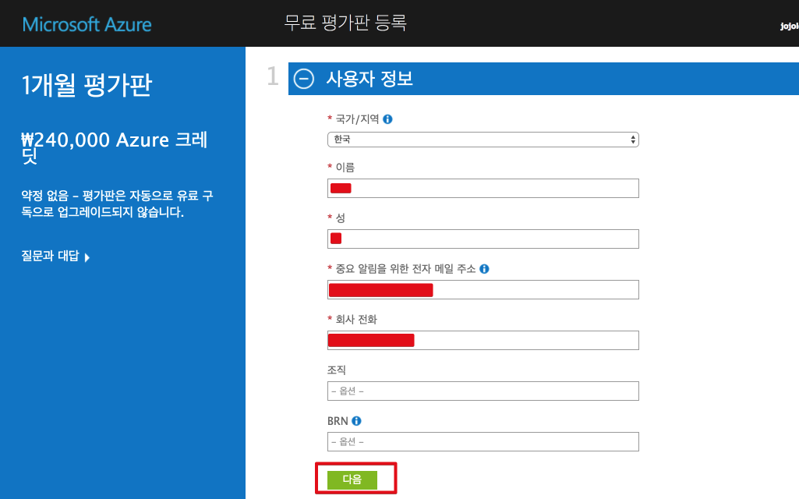
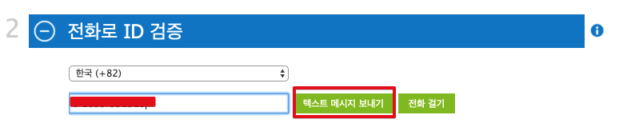

# MS Azure Translate 토큰 발급 받기

번역 플러그인을 좀 더 많이 사용하기 위해선 직접 API 토큰을 발급 받아야 합니다.  
(직접 토큰 없을 경우 월 200건, 직접 토큰 사용시 월 200만건 가능)  
  
MS의 [공식문서](http://docs.microsofttranslator.com/text-translate.html)를 참고하셔도 되지만, 그게 어렵다 하시는 분들을 위해 가이드 문서를 작성하였습니다.  

최대한 이미지를 통해서 쉽고 빠르게 토큰을 발급 받을 수 있도록 작성하였습니다.  

### 1. 회원가입

[MS Azure](https://azure.microsoft.com/ko-kr/)에 접속하여 회원가입을 진행합니다.  

MS의 계정이 있다면 바로 로그인 하시면 되고, 없으시면 MS 계정을 생성합니다.  
(**Azure의 계정이 아닌, MS의 계정**입니다. 윈도우나 오피스를 구입하신 분들의 경우 키 등록을 위해 보통 가입하셨을 것입니다.)

가입이 완료되셨으면 [Azure 포탈](https://portal.azure.com) 로 이동후, 좌측 상단의 새로 만들기 버튼을 클릭합니다.  

서비스 검색 화면이 나올텐데 거기에 **Translator Text API**를 검색합니다.

결과물에서 **Translator Text API**를 클릭합니다.

만들기 버튼을 클릭합니다.

그럼 새 구독 화면이 나올텐데, **새 구독에 등록**을 클릭합니다.

처음 MS 계정을 만들고 Azure 가입정보를 등록하지 않았기 때문에 아래와 같이 Azure 가입을 위한 정보를 등록해야 합니다.

