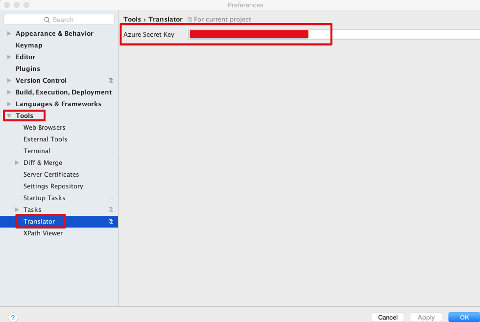

# Translator IntelliJ Plugin(for Korean)

주석 해석, 변수명 찾기 등 개발 중 번역기를 사용하는 일이 빈번합니다.  
구글 번역창, 네이버 사전을 항상 열어놓는것도 귀찮아 번역 플러그인 제작을 시작하였습니다.

## 사용법

### 기본 번역

단축키 : ```option+1```


### 번역 및 변환

단축키 : ```option+2```


### 자동 선택모드 지원

**영역 선택할 경우**


**영역 선택하지 않을 경우**


### 자동 언어 감지


## 설치 및 설정

### 설치


### API KEY 발급

구글 번역 API는 **유료**만 있습니다.  
그래서 무료 API를 사용해야합니다.

* [MS Guide](http://docs.microsofttranslator.com/text-translate.html)
  * **월 200만**건까지 무료
  * 키 발급이 조금 귀찮은 면이 있습니다.
  * 해외분들에게 추천합니다.
* [네아버 API](http://blog.naver.com/PostView.nhn?blogId=killkimno&logNo=220647426967)
  * **하루 1만**건까지 무료
  * 키 발급이 정말 간단합니다.
  * 국내 분들에게 추천합니다.

등록하지 않을 경우 월 200 쿼리만 실행 가능합니다.

### API KEY 등록

발급 받은 Key를 아래 위치에 등록해주세요.



등록 후, 바로 기능을 사용하시면 됩니다.

## Release Notes

* 0.0.8
  * Naver 번역 API 지원
* 0.0.7
  * Api Key 조회 버그 수정
* 0.0.6
  * 비동기 진행으로 전체 이벤트 변경
* 0.0.5
  * 포커스에 따라 자동 텍스트 선택 기능 추가
* 0.0.4
  * 조회시 로딩 팝업 기능 추가
* 0.0.3
  * 버그 수정
* 0.0.2
  * 기본 번역 기능 추가
  * 번역 & 텍스트 교체 기능 추가
* 0.0.1
  * 프로젝트 생성

## 참고

* [차영호님의 플러그인 제작 발표 자료](https://news.realm.io/kr/news/android-studio-plugin-development/)
* [중국인이 만든 번역 플러그인](https://github.com/YiiGuxing/TranslationPlugin)
* [IntelliJ 텍스트 관련 플러그인 메뉴얼](http://www.jetbrains.org/intellij/sdk/docs/tutorials/editor_basics/working_with_text.html)
* [IntelliJ 컴포넌트 위치 관련 플러그인 메뉴얼](http://www.jetbrains.org/intellij/sdk/docs/tutorials/editor_basics/coordinates_system.html)
* [IntelliJ 플러그인 적용 가능한 버전 확인을 위한 빌드넘버 리스트](https://www.jetbrains.com/intellij-repository/releases)
* [Gradle 프로젝트로 IntelliJ 플러그인 제작 메뉴얼](http://www.jetbrains.org/intellij/sdk/docs/tutorials/build_system/prerequisites.html)
* [gradle-intellij-plugin](https://github.com/JetBrains/gradle-intellij-plugin)
* [Plugin FAQ](http://www.jetbrains.org/intellij/sdk/docs/faq.html)
* [Plugin 설정 기능 가이드](http://corochann.com/intellij-plugin-development-introduction-applicationconfigurable-projectconfigurable-873.html)