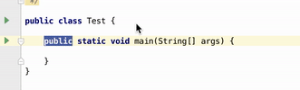

# translator

스프링프레임워크를 비롯하여 오픈소스 코드를 추적하다보면 주석을 읽을 필요가 있습니다.  
주석 코드를 해석하기 위해 계속해서 구글번역을 왔다갔다 하는 것이 불편하여 IDE에서 바로 번역해서 볼 수 있도록 번역 플러그인을 만들었습니다.  

## 사용법

기본기능 : ```option+1```



### API KEY 발급

구글 번역 API는 **유료**만 있습니다.  
그래서 **MS Azure API**를 사용하였습니다.  
(Azure의 경우 **월 200만**건 까지 무료입니다.)  
아래 링크를 참고하여 MS Azure API Key를 발급 받아주세요  

* [MS Guide](http://docs.microsofttranslator.com/text-translate.html)

### API KEY 등록

발급 받은 Key를 아래 위치에 등록해주세요.


등록 후, 바로 기능을 사용하시면 됩니다.

## 참고

* [차영호님의 플러그인 제작 발표 자료](https://news.realm.io/kr/news/android-studio-plugin-development/)
* [중국인이 만든 번역 플러그인](https://github.com/YiiGuxing/TranslationPlugin)
* [IntelliJ 텍스트 관련 플러그인 메뉴얼](http://www.jetbrains.org/intellij/sdk/docs/tutorials/editor_basics/working_with_text.html)
* [IntelliJ 컴포넌트 위치 관련 플러그인 메뉴얼](http://www.jetbrains.org/intellij/sdk/docs/tutorials/editor_basics/coordinates_system.html)
* [IntelliJ 플러그인 적용 가능한 버전 확인을 위한 빌드넘버 리스트](https://www.jetbrains.com/intellij-repository/releases)
* [Gradle 프로젝트로 IntelliJ 플러그인 제작 메뉴얼](http://www.jetbrains.org/intellij/sdk/docs/tutorials/build_system/prerequisites.html)
* [gradle-intellij-plugin](https://github.com/JetBrains/gradle-intellij-plugin)
* [Plugin FAQ](http://www.jetbrains.org/intellij/sdk/docs/faq.html)
* [Plugin 설정 기능 가이드](http://corochann.com/intellij-plugin-development-introduction-applicationconfigurable-projectconfigurable-873.html)