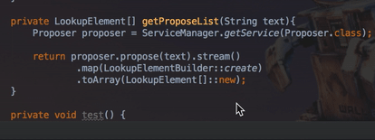
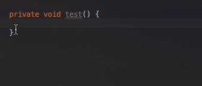
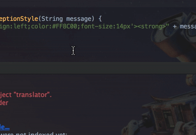
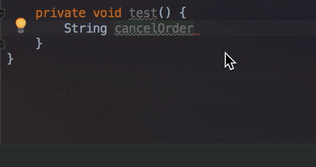
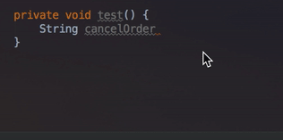
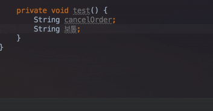
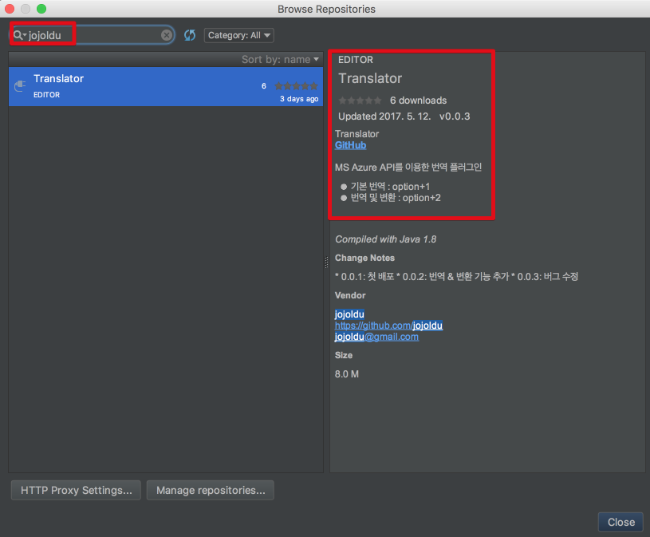
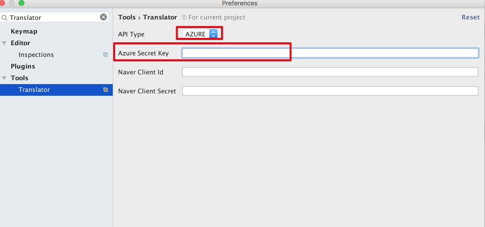
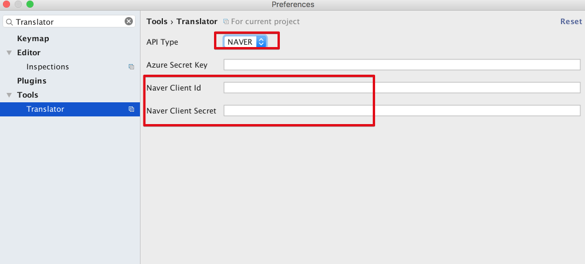

# Translator IntelliJ Plugin(for Korean)

[]()
[]()
[](https://travis-ci.org/jojoldu/translator)
[](https://coveralls.io/github/jojoldu/translator?branch=master)

[Korean](./README.md) | [English](./README_EN.md)  

Interpreting comments, finding variable names, and so on.
We have begun to produce translation plug-ins because it is annoying to always open the Google translation window and the Naver dictionary.

## Supported versions

* IntelliJ 2017.1 or later
* Android Studio 3.0.0 or later (current Canary version)
* Other JetBrains IDE 2017.1 or later (WebStorm, PhpStorm ..)

## Usage

### Default Translate

shortcuts : ```option+1```



### Translate And Replace

shortcuts : ```option+2```



### Translate Dialog

shortcuts : ```option+3```




### Auto Selection

#### Select Text



#### None Select Text




### Automatic language detection




## Install & Preferences

### Install



### Issue API KEY 

**Google Translate API is paid**.  
So you have to use the free API.

* [MS Guide](http://docs.microsofttranslator.com/text-translate.html)
  * Free up to **2 million per month**
  * The key issuance process is a little annoying.
  * It is recommended for overseas people.
* [Naver API](http://blog.naver.com/PostView.nhn?blogId=killkimno&logNo=220647426967)
  * Free up to **10,000 per day**
  * The key issuing process is really simple.
  * Recommended for Koreans.

If you do not register, **only 200 queries per month** can be executed.

### Regist API KEY

It can be used if only one of the two APIs is registered.

#### Azure  

Please register the Secret Key that was issued to the following location.



#### Naver  

Please register ClientId and ClientSecret issued



## Release Notes

* 0.0.14
  * Compatible since 2017.1 until 2018.1
* 0.0.10
  * Translate Dialog
* 0.0.9
  * Added default mode
* 0.0.8
  * Naver translation API support
* 0.0.7
  * Fixed Api Key lookup bug
* 0.0.6
  * Asynchronous progress to change entire event
* 0.0.5
  * Added automatic text selection function according to focus
* 0.0.4
  * Added loading popup function when viewing
* 0.0.3
  * Bug fixes
* 0.0.2
  * Added basic translation function
  * Added translation & text replacement function
* 0.0.1
  * Create project

## Reference

* [Cha Young-ho's plug-in production presentation](https://news.realm.io/kr/news/android-studio-plugin-development/)
* [Chinese translation plugin](https://github.com/YiiGuxing/TranslationPlugin)
* [IntelliJ text-related plugin manual](http://www.jetbrains.org/intellij/sdk/docs/tutorials/editor_basics/working_with_text.html)
* [IntelliJ component location related plug-in manual](http://www.jetbrains.org/intellij/sdk/docs/tutorials/editor_basics/coordinates_system.html)
* [Build number list for checking the applicable version of the IntelliJ plugin](https://www.jetbrains.com/intellij-repository/releases)
* [IntelliJ plugin development manual with Gradle project](http://www.jetbrains.org/intellij/sdk/docs/tutorials/build_system/prerequisites.html)
* [gradle-intellij-plugin](https://github.com/JetBrains/gradle-intellij-plugin)
* [Plugin FAQ](http://www.jetbrains.org/intellij/sdk/docs/faq.html)
* [Plugin Preferences Development Guide](http://corochann.com/intellij-plugin-development-introduction-applicationconfigurable-projectconfigurable-873.html)
